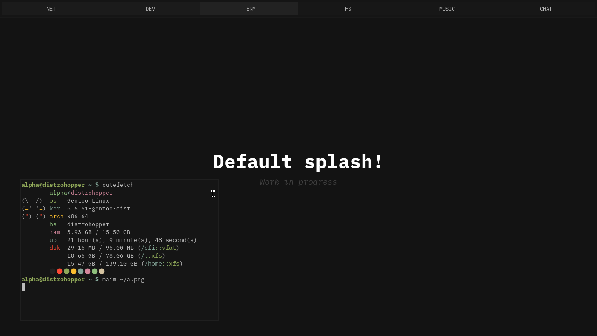

# Aether shell

Aether shell is my effort to make a good & useful shell for
the AwesomeWM project adapted to my needs.

This project mostly serves as the official UI project for my
custom nixos configuration environment, check out
[nixmoment](https://github.com/alphatechnolog/nixmoment)



## Installation

You can install this setup by using nixmoment which should
automatically deploy this project along with a fully working
nixos-based operating system. But in order to install it
in another distro, you could follow the next steps
(arch-like installation, should be pretty much the same
for others distros tho).

1. Install some basic dependencies

```sh
# git ofc
sudo pacman -S git base-devel

# aur?
mkdir -pv ~/repo
cd !$
git clone https://aur.archlinux.org/yay-bin.git --depth=1 yay
cd !$
makepkg -si

# go back :D
cd ~
```

2. Install awesomewm (git version)

Aether shell requires the git version of AwesomeWM in order
to work, you can get it with the arch user repository, but in
other distros, you might have to build it completely yourself.

In gentoo you could unmask `gui-wm/awesome:9999` iirc.

```sh
yay -S awesome-git
```

3. Install xorg

Xorg ofc

```sh
# xorg and xorg-xinit (iirc that's the package name).
sudo pacman -S xorg{,-xinit}
echo 'exec awesome' > .xinitrc
```

4. Clone the configuration

```sh
git clone https://github.com/alphatechnolog/aether-shell.git \
    --recurse-submodules \
    ~/.config/awesome

# create some common aether shell folders
mkdir -pv \
    ~/.config/aether-shell \
    ~/.cache/aether-shell
```

> Aether shell will create the needed files anyways tho.

5. Install some required packages

Aether shell requires some packages in order to work. These
may be updated over the time, so be careful and report if
any packages-missing-related errors arrives.

```sh
sudo pacman -S \
    bluez blueman pulseaudio pavucontrol \
    playerctl networkmanager alacritty \
    firefox thunar

sudo systemctl enable --now NetworkManager
sudo systemctl enable --now bluetooth
```

> Note that you may also require to setup a picom (fork?)
> You can find my picom (sdhand fork) [here](../extras/picom/picom.conf)

Now you have to install some fonts.

- [Roboto](https://fonts.google.com/specimen/Roboto)
- [Material Symbols](https://downgit.evecalm.com/#/home?url=https://github.com/google/material-design-icons/tree/1ea21d5429750938f4a8e694e75a54fc0f02dae1/variablefont)

> Note that material symbols has a very specific commit, which is the tested one, keep in mind that updating it may end with aether shell displaying weird symbols

```sh
# assumming fonts are in ~/Downloads

cd ~/Downloads

sudo pacman -S unzip --noconfirm # ofc

unzip variablefont.zip
unzip Roboto.zip

mkdir -pv ~/.local/share/fonts

mv -v ./*.ttf ~/.local/share/fonts
mv -v ./variablefont/*.{ttf,woff2} ~/.local/share/fonts

fc-cache -vf
```

6. Run aether shell

You may wanna use something like lightdm, or sddm, that's your choice.
Here, we're assumming you'd wanna use something like `startx` instead,
that's why we did install xorg-xinit before. So you can do

```sh
startx
```

And you should start seeing aether shell running.

## NixOS integration

[nixmoment](https://github.com/alphatechnolog/nixmoment) is a very practical example
on how to install aether shell in nixos, but here's a little resume on how to install
it if you don't wanna read too much code.

1. Installation of AwesomeWM git

Since aether shell requires awesomewm git, we should figure out a way to install
AwesomeWM git with NixOS, and for that, you can try using the
[nixpkgs-f2k](https://github.com/moni-dz/nixpkgs-f2k) repository. So first include
it like this in your flake.nix

> In these code examples, we're assumming you're putting your inputs in a specialAttrs value
> and that you also know where to put these codes.

```nix
{
    inputs = {
        nixpkgs-f2k.url = "github:moni-dz/nixpkgs-f2k";
    };
}
```

And then load the awesomewm overlay

```nix
{inputs, ...}: {
    nixpkgs.overlays = [
        (final: _: let
            inherit (final) system;
            inherit (inputs) nixpkgs-f2k;
        in
            with nixpkgs-f2k.packages.${system}; {
                awesome = awesome-luajit-git;
            }
        )
    ];
}
```

So after that you could just install it through the regular
windowmanager options.

```nix
{ lib, pkgs, ... }: {
    services.xserver = {
        enable = true;

        windowManager.awesome = {
            enable = true;

            luaModules = lib.attrValues {
                inherit (pkgs.luaPackages)
                    lgi
                    ldbus
                    luadbi-mysql
                    luaposix
                ;
            };
        };
    };
}
```

And with that, Awesome Git with luajit support should be installed
successfully after a rebuild.

2. Install aether shell via its flake

Add aether shell as one of your inputs

```nix
{
    inputs = {
        nixpkgs-f2k.url = "github:moni-dz/nixpkgs-f2k";
        aether-shell.url = "github:alphatechnolog/aether-shell";
    };
}
```

Now, include the home manager module in your home manager configuration

```nix
{ inputs, ... }: {
    imports = with inputs; [
        aether-shell.homeManagerModules.aetherShell
    ];
}
```

Then, you can just configure aether shell using the hm module properties.

```nix
{
    programs.aetherShell = {
        enable = true;

        autostart = [
            "bash -c 'pgrep -x picom || picom -b'"
        ];

        user-likes = {
            wallpaper.filename = ./wallpaper.png;
            wallpaper.rounded_corners.roundness = 0;
            colors.background = "#000000";
        };
    };
}
```

> Ignored values are kept as the default ones, even wallpaper

> [!TIP]
> You can use all the options defined in [manager.lua](../framework/configuration/manager.lua)
> in the nix module, im trying my best to keep this up to date!

After a rebuild, the home manager module, should install the needed fonts
and the config with your tweaks.

## What's next?

Welp, documentation is still not ready, and not done whatsoever, so
you may have to explore through configuration files if you want!

Anyways check out:

- `~/.config/aether-shell/user-likes.json`
- `~/.config/aether-shell/general-behavior.json`
- `~/.config/aether-shell/autostart.json`

> Those are the actual configuration files of aether shell

Generated cache will be saved at `~/.cache/aether-shell`, nothing
to mess with there...

> Keep in mind that configuration files structure may change though.
